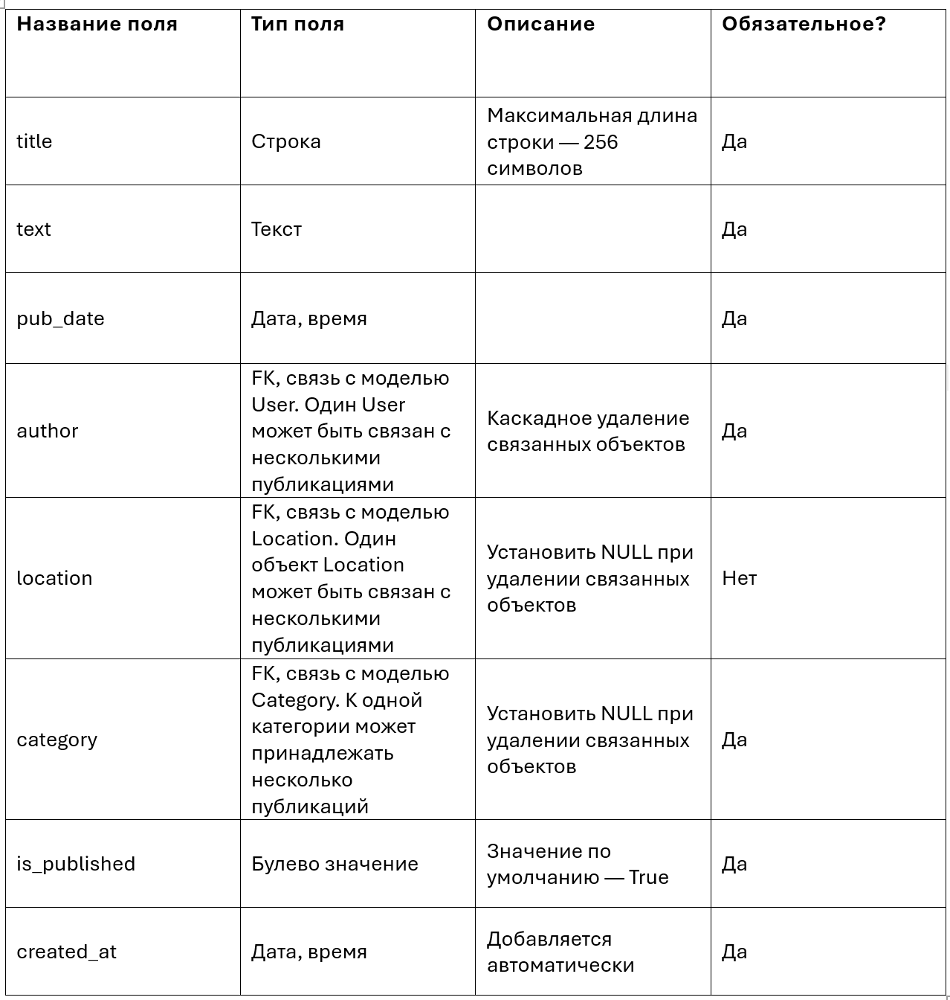
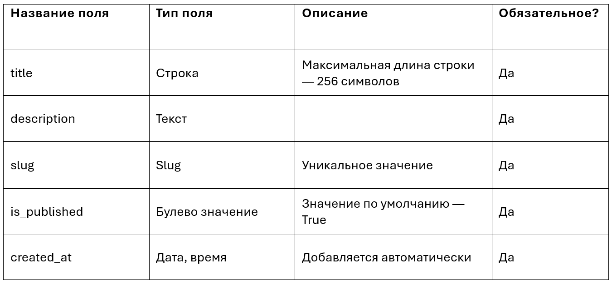
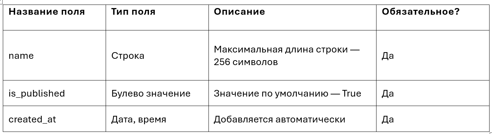

### Для выполнения работы рекомендуется python 3.9!(возможно использовать версии python 3.6-3.10)

### Не рекомендуется иметь виртуальное окружение не связанное с проектом в директориях выше!

# Баллы за работу:
0.5 балла - Реализация моделей в соответствии с ТЗ.
0.5 балла - Задания связанные с админкой, максимальная русификация админки и проекта в целом.
0.5 балла - Правильная структура всех папок и файлов, БД со структурой необходимой для загрузки фикстур, загруженные фикстуры.
0.5 балла - Главная страница проекта (соответствует тз и шаблонам,работает).
1 балл - Страница отдельной публикации (соответствует тз и шаблонам,работает).
1 балл - Страница категории (соответствует тз и шаблонам,работает).
1 балл - Предыдущие пункты выполены и все тесты проходят проверку.

Дополнительный 1 балл можно получить при соблюдении принципа DRY, pep8(полностью), достаточной оптимизации запросов.

-1 балл  - систематическое несоблюдение PEP8.

Использование браузера, телефона, AI ---> АННУЛИРУЕТ ВСЕ БАЛЛЫ!


# Как устроен Блог
Главное в блоге — это публикация («пост»), вокруг неё всё и строится. 

У каждой публикации на проекте должны быть такие атрибуты:
 - Заголовок поста.
 - Основной текст поста.
 - Дата публикации. Автор поста (или суперпользователь) могут установить любую дату публикации, в том числе — ещё не наступившую, в будущем.
 - Дата добавления публикации в базу данных.
 - Флаг «опубликовано».
 - Автор: зарегистрированный на проекте пользователь. Авторов могут добавлять суперпользователи.
 - Локация: одно определённое местоположение, к которому относится пост; локация может быть не указана, тогда на уровне шаблона в качестве локации отображается значение «Планета Земля».
 - Категория: подборка, в которой собраны посты по определённой теме.

Логика работы проекта:
 - Без указания какой-либо одной категории новый пост добавить нельзя.
 - Локацию для поста указывать необязательно.
 - Администратор сайта может снять с публикации любой пост, категорию и локацию.
 - Пост отображается на страницах проекта, если у него одновременно:
            дата публикации — не позже текущего времени,
            он опубликован,
            категория, к которой он принадлежит, не снята с публикации;

 * Локация, снятая с публикации, не влияет на отображение связанных с ней постов.


# Подготовка к выполнению задания:

1. Разверните и активируйте виртуальное окружение в папке django_control_point_1
2. Обновите pip
3. Установите зависимости (python 3.9, а Django 3.2, если не так, корректируйте вручную)
4. После установки проекта должна получиться такая структура файлов:

 └── django_control_point_1/
     ├── .vscode/    Служебная папка редактора кода (опционально, скрытая)
     ├── .git/       Служебная информация Git (скрытая) 
     ├── tests/             Тесты, проверяющие проект
     ├── venv/              Директория виртуального окружения
     ├── project_blog_02/          <-- Директория проекта
     |   ├── blog/
     |   ├── pages/
     |   ├── static/
     |   ├── templates/     <-- новые шаблоны
     |   ├── project_blog_02/
     |   ├── db.sqlite3     Файл базы данных (может и не быть)
     |   └── manage.py
     ├── .flake8            Настройки тестов (скрытый) 
     ├── .gitignore         Список файлов и папок, скрытых от отслеживания Git (скрытый) 
     ├── db.json            <-- Фикстуры для базы данных    
     ├── pytest.ini         Конфигурация тестов
     ├── README.md          ТЗ и описание проекта
     └── requirements.txt   Список зависимостей проекта


# Задания

Первым делом удалите из файла blog/views.py словарь posts. Он больше не понадобится, дальше будем работать по-настоящему, с базой данных.

## 1.Создайте модели проекта
В приложении blog потребуются следующие модели:
 - Post (Публикация)
 - Category (Тематическая категория)
 - Location (Географическая метка)
 - User (Пользователь, эту модель описывать не нужно, она встроена в Django)

### Данные для описания моделей:
Post (Публикация)


Category (Тематическая категория)


Location (Географическая метка)


User (Пользователь)
 - Модель User встроена в Django и готова к работе.
 - В файле моделей принято указывать ее в начале.
 - Сослаться на неё из другой модели можно так:
```python
from django.contrib.auth import get_user_model
...

User = get_user_model()

...

class Post(models.Model):
    author = models.ForeignKey(
        User,
        on_delete=models.CASCADE           
    )
    ...
```

## 2.Настройте панель администратора и выполните русификацию
Настройте админ-зону проекта так, чтобы можно было управлять в админ-зоне созданием, изменением и удалением объектов моделей:
 - Category
 - Location
 - Post
Лишние модели отключите(кроме USER)

Переключите панель администратора на русскую локализацию и укажите обозначения на русском языке:
 - Название приложения Blog переведите на русский: «Блог»
 - Переведите названия моделей:
Название модели	    Единственное число	    Множественное число
Category	        категория	            Категории
Location	        местоположение	        Местоположения
Post	            публикация	            Публикации

 - Переведите названия атрибутов моделей:
is_published	    Опубликовано
title	            Заголовок
slug	            Идентификатор
description	        Описание
pub_date	        Дата и время публикации
text	            Текст
author	            Автор публикации
category	        Категория
location	        Местоположение
created_at	        Добавлено
name	            Название места

 - Добавьте тексты-подсказки к полям:
Название поля	    Подсказка
is_published	    Снимите галочку, чтобы скрыть публикацию.
slug	            Идентификатор страницы для URL; разрешены символы латиницы, цифры, дефис и подчёркивание.
pub_date	        Если установить дату и время в будущем — можно делать отложенные публикации.


## Шаблоны
Новые HTML-шаблоны с вёрсткой готовы. В шаблонах, в тегах {{ }} указано, какая информация должна быть выведена в каждом конкретном месте шаблона. 


## 3.View-функции и запросы к БД
Обновите код view-функций: настройте ORM-запросы так, чтобы на страницы проекта выводилась требуемая информация.

### Содержимое страниц
1. Главная страница проекта
Выводятся пять последних публикаций. 
На главной странице должны показываться только те публикации, у которых одновременно:
  -дата публикации — не позже текущего времени,
  -значение поля is_published равно True,
  -у категории, к которой принадлежит публикация, значение поля is_published равно True.

2. Страница категории
Выводятся только те публикации, которые:
  -принадлежат выбранной категории,
  -значение поля is_published равно True,
  -дата публикации — не позже текущего времени.
Если у запрошенной категории значение поля is_published равно False — должна возвращаться ошибка 404.

3. Страница отдельной публикации
Выводится отдельная публикация, полученная по первичному ключу. 
Запрос к странице публикации должен вернуть ошибку 404, если: 
  -дата публикации — позже текущего времени
  -или значение поля is_published у запрошенной публикации равно False,
  -или у категории, к которой принадлежит публикация, значение поля is_published равно False.


# Проверка
1.Запустите тесты локально, на компьютере. В активированном виртуальном окружении через терминал из папки Dev/project_blog_02 выполните команду pytest.

2.Убедитесь, что проект написан с использованием возможностей Python 3.9(рекомендованная версия) Тесты также рекомендуется запускаться именно на этой версии Python.

3.Убедитесь, что все приложения проекта добавлены в INSTALLED_APPS в файле settings.py

4.Убедитесь, что в репозитории есть все миграции.